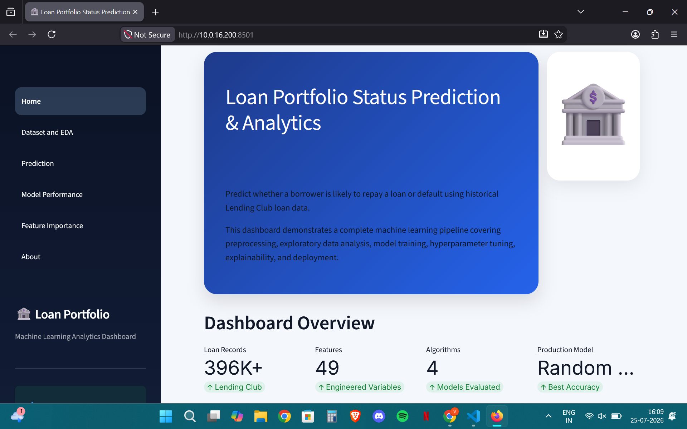
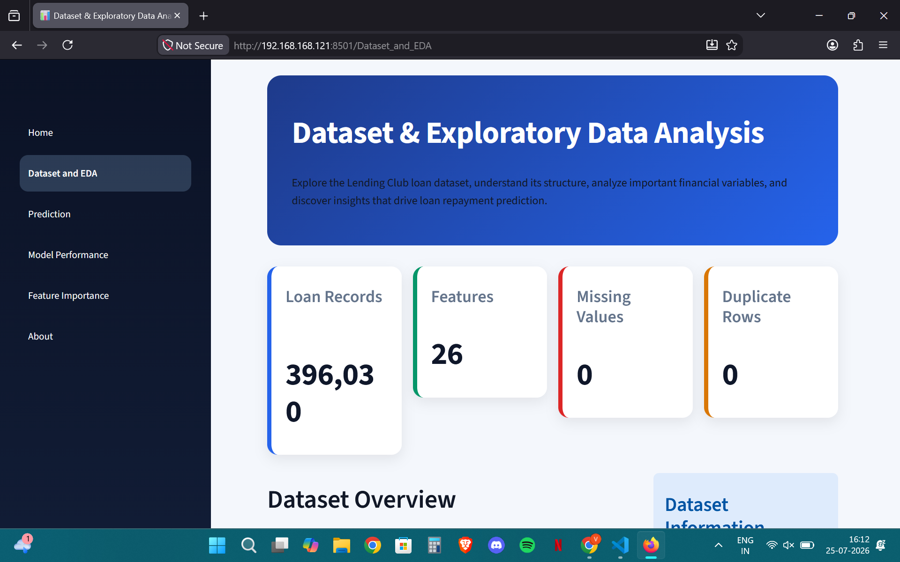
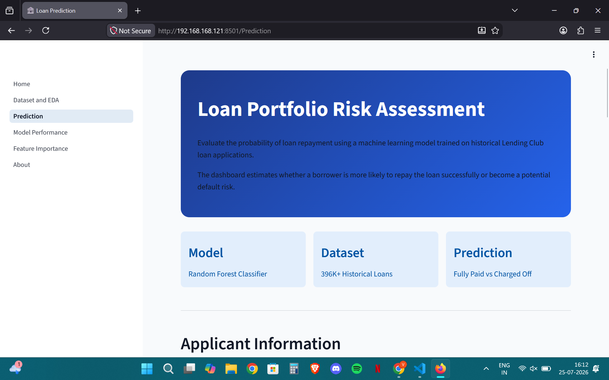
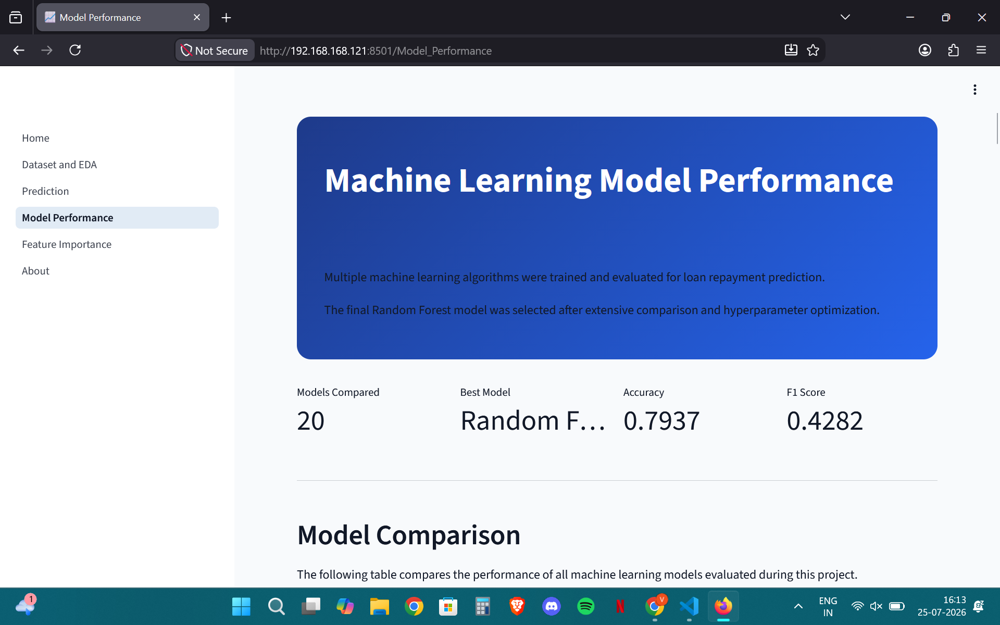
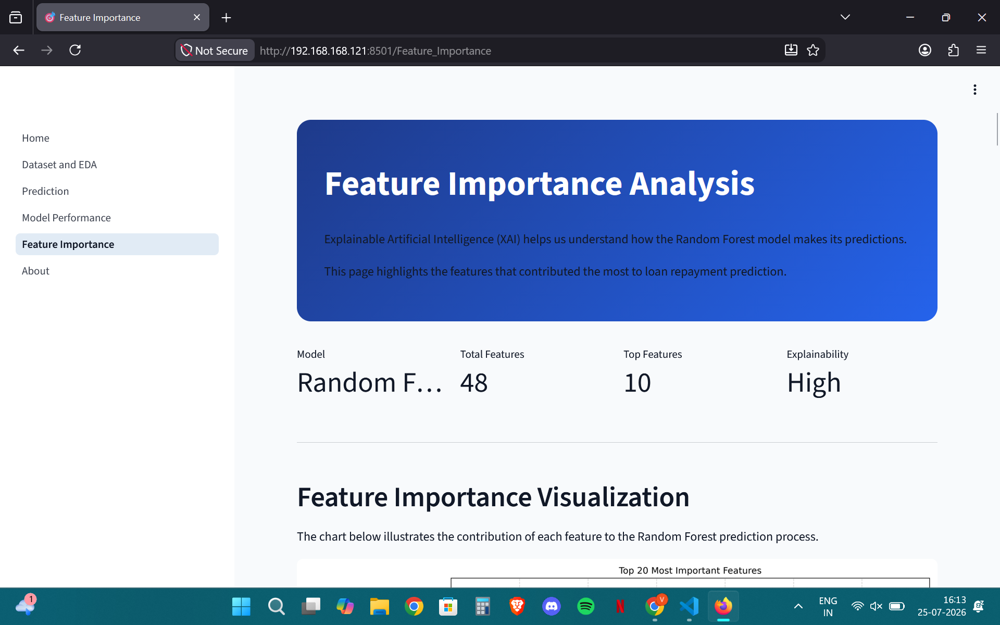

# Loan Portfolio Status Prediction and Analytics

An end-to-end Machine Learning project that predicts whether a loan is likely to be **Fully Paid** or **Charged Off** using historical Lending Club loan data.

The project covers the complete machine learning lifecycle, including data understanding, data cleaning, exploratory data analysis, feature engineering, preprocessing, model development, hyperparameter tuning, model evaluation, feature importance analysis, and deployment using Streamlit.

---

## Project Overview

Financial institutions process thousands of loan applications every day. Approving loans for applicants who are likely to default can lead to significant financial losses.

This project develops a machine learning solution capable of predicting loan repayment status based on applicant information and historical lending records.

The application also provides an interactive Streamlit dashboard for exploring the dataset, understanding model performance, viewing feature importance, and making predictions on new loan applications.

---

## Business Problem

Banks and lending institutions need reliable methods to identify high-risk loan applicants before approving loans.

Accurate loan default prediction helps organizations:

- Reduce financial losses
- Improve lending decisions
- Minimize bad debt
- Improve portfolio quality
- Support risk assessment teams

Instead of relying only on manual evaluation, this project uses machine learning to assist in identifying risky applicants.

---

## Features

- End-to-End Machine Learning Pipeline
- Data Cleaning
- Exploratory Data Analysis
- Feature Engineering
- Data Preprocessing
- Model Comparison
- Hyperparameter Tuning
- Feature Importance Analysis
- Interactive Loan Prediction
- Streamlit Web Application

---

## Dataset

**Dataset:** Lending Club Loan Dataset

**Prediction Type:** Binary Classification

Target Variable:

| Loan Status | Meaning |
|-------------|----------|
| Fully Paid | Low Risk |
| Charged Off | High Risk |

---

## Technology Stack

| Category | Tools |
|----------|------|
| Language | Python |
| Data Processing | Pandas, NumPy |
| Visualization | Matplotlib |
| Machine Learning | Scikit-learn |
| Model Persistence | Joblib |
| Deployment | Streamlit |

---

## Machine Learning Workflow

```
Raw Dataset
      │
      ▼
Data Understanding
      │
      ▼
Data Cleaning
      │
      ▼
Exploratory Data Analysis
      │
      ▼
Feature Engineering
      │
      ▼
Preprocessing
      │
      ▼
Train-Test Split
      │
      ▼
Model Training
      │
      ▼
Model Comparison
      │
      ▼
Hyperparameter Tuning
      │
      ▼
Feature Importance
      │
      ▼
Prediction
      │
      ▼
Streamlit Deployment
```

---

## Project Structure

```
Loan-Portfolio-Status-Prediction-Analytics/

│
├── app.py
├── README.md
├── requirements.txt
│
├── assets/
│
├── data/
│   ├── raw/
│   └── processed/
│
├── images/
│
├── models/
│
├── outputs/
│
├── pages/
│   ├── Dataset_and_EDA.py
│   ├── Prediction.py
│   ├── Model_performance.py
│   ├── Feature_importance.py
│   └── About.py
│
├── reports/
│
└── src/
    ├── data_understanding.py
    ├── data_cleaning.py
    ├── data_quality.py
    ├── eda.py
    ├── preprocessing.py
    ├── model_comparison.py
    ├── hyperparametertuning.py
    ├── feature_importance.py
    └── predictor.py
```

---

## Data Preprocessing

The preprocessing pipeline performs:

- Target Variable Creation
- Feature Engineering
- Train-Test Split
- Ordinal Encoding
- One-Hot Encoding
- Feature Scaling
- Saving preprocessing artifacts for deployment

Artifacts saved:

- OneHotEncoder
- StandardScaler
- Feature Columns

These artifacts ensure the prediction pipeline processes new user inputs exactly as the training data.

---

## Machine Learning Models

The following classification algorithms were trained and evaluated:

- Logistic Regression
- Decision Tree
- Gradient Boosting
- Random Forest

Each model was evaluated using:

- Accuracy
- Precision
- Recall
- F1 Score
- ROC-AUC Score

---

## Hyperparameter Tuning

The final Random Forest model was optimized using:

- RandomizedSearchCV
- Cross Validation
- SMOTE for class balancing
- Threshold Optimization

The tuned model demonstrated the best overall balance between precision and recall.

---

## Feature Importance

Feature importance analysis identified the most influential variables affecting loan repayment prediction.

Examples include:

- Interest Rate
- Grade
- Sub Grade
- Debt-to-Income Ratio
- Annual Income
- Loan Amount
- Revolving Utilization
- Employment Length
- Mortgage Accounts
- Total Accounts

These insights improve model interpretability and support business decision-making.

---

## Streamlit Application

The web application includes the following pages:

### Home

Project overview and workflow.

### Dataset & EDA

Dataset information and exploratory visualizations.

### Prediction

Interactive loan status prediction using the trained Random Forest model.

### Model Performance

Comparison of machine learning algorithms and evaluation metrics.

### Feature Importance

Visualization of the most influential features.

### About

Project summary, technologies, limitations, and future improvements.

---

## Screenshots

### Home



---

### Dataset & EDA



---

### Prediction



---

### Model Performance



---

### Feature Importance



---

## Installation

Clone the repository:

```bash
git clone https://github.com/Vibhor-Aggarwal/Loan-Portfolio-Status-Prediction-Analytics.git
```

Move into the project directory:

```bash
cd Loan-Portfolio-Status-Prediction-Analytics
```

Install dependencies:

```bash
pip install -r requirements.txt
```

Run the application:

```bash
streamlit run app.py
```

---

## Future Improvements

Possible enhancements include:

- XGBoost implementation
- LightGBM implementation
- SHAP Explainability
- Probability-based Risk Scoring
- Cloud Deployment
- Model Monitoring
- REST API using FastAPI
- Docker Containerization

---

## Author

**Vibhor Aggarwal**

GitHub

https://github.com/Vibhor-Aggarwal

---

## License

This project is licensed under the MIT License.